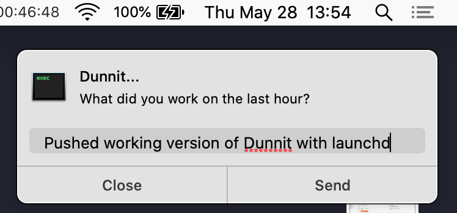

# Dunnit Time Recorder

Dunnit is a KISS process for recording your daily activity. It’s
dumbly simple, works only on a Mac (for now). It is not a TODO app.
TODOs are a totally different things than Dunnits.

Dunnit is set to pop up a notification prompt every hour to ask you
what you worked on. The update you record in the popup is saved to a
daily log. At the end of a good day you’ll end up with a timestamped
list of things you worked on.

Analysis is CLI-driven. You can roll up your Dunnits at the end of a
week or a month. Generate status reports and aggregate by tag
categories.



## Install and Run

Do all these steps from a terminal.

1. Clone this Dunnit repo. If you decide to clone it to somewhere
   other than `~/dunnit`, edit `dunnit.plist` to adjust the path
   accordingly.

   ```sh
   cd # to your $HOME
   git clone https://github.com/MicahElliott/dunnit.git
   cd dunnit
   ```

1. Install most prerequisites via Homebrew:

   ```sh
   % brew install direnv bat fzf coreutils the_silver_searcher
   ```

1. Install Alerter: Download, extract, and install the
   [alerter zip file](https://github.com/vjeantet/alerter/releases):

   ```sh
   wget https://github.com/vjeantet/alerter/releases/download/003/alerter_v003_darwin_amd64.zip
   unzip alerter_v003_darwin_amd64.zip
   mv alerter /usr/local/bin/alerter
   ```

1. Run alerter manually once to ensure it’ll work: `alerter -message hi`

1. Run `./dunnit-bubble` manually once to see it working.

1. Start the dunnit service: `launchctl load -w dunnit.plist`

If it doesn’t seem to be working, check for dunnit output and error
logs in `/tmp`.

## Usage

Answer the popup prompt every hour (or ignore it; you have 2 minutes
till it disappears). Use #hashtags to categorize your entries; that
helps with later analysis.

If you didn’t accomplish anything noteworthy, just click **Nothing**
(or **Close**), and no entry will be recoded for the hour.

You can _snooze_ by clicking **Reply** and then **Send** with an empty
message.

At the end of the week (or day), look over what you did in the
`$DUNNIT_DIR` log. There is a convenience shortcut to show you any
day’s status: <kbd>Ctrl-t</kbd>

```sh
% source setup.zsh
% «Ctrl-t»
```

You can **stop the service** (if you ever feel the need) with:
`launchctl unload dunnit.plist`.

### Hashtagging

It’s a good idea to adopt some tagging conventions for categorizing
your Dunnits. Suggestions: ticket numbers, `#star`, `#rollup`

Search for hashtags across all log files:

```sh
% g '#mywork'
log/2020/w22-May/20200529-Thu.log
[1518] Added snooze feature to #mywork

log/2020/w22-May/20200528-Wed.log
[1739] Added proper LAST message to #mywork

log/2020/w23-Jun/20200601-Mon.log
[1605] Refactored and added some separated commands to #mywork
```

## Customization

The following config reflects the defaults. It will leave you with
a local directory and sequence of files (with timestamped lines) like:
`~/dunnit/log/2020/w23-Jun/20200530-Mon.log`

```sh
# The location of all the daily dunnit log files
export DUNNIT_DIR=~/doc/dunnit

# THESE ARE NOT YET IMPLEMENTED…
# The timestamp format for each entry
export DUNNIT_TIME_FMT='%…'
# The directory format
export DUNNIT_DATE_FMT='%…'
# Use org-mode date-stamp formatting and file extensions
export DUNNIT_USE_ORG=false
```

## Example Dunnit Log for a Day

```log
[0800] Walked the dog, listened to a podcast; not feeling very productive
[0900] Started the work day with a boring meeting
[1000] Refactored the time traveller #DUMB-42
[1100] Addressed a few linter errors #DUMB-42
[1400] Drew the diagram
[1500] Reviewed John’s PR; tried to make my Emacs windowing faster
[1700] Figured out why the data isn’t showing up in the bucket #DUMB-97
```

## TODO

- maybe package up as a homebrew service
- add a couple utils to analyze/summarize the day, week, etc
- throw away launchd and just go with daemonize
- flexible scheduler to run on the hour instead of when started
- generate a weekly or monthly status report with the key tagged
  #rollup items
- histogram/word cloud of used hashtags
- ask at end of day if you want to see all the Dunnits
