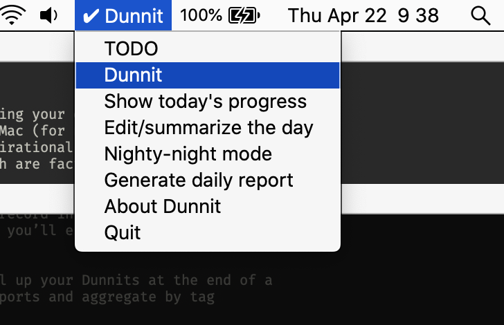

# Dunnit Time Recorder

Dunnit is a KISS process for recording your daily goals and activity
and making that easy to find and use for weekly, monthly, and any sort
of reporting — think resumes, daily standups, quarterly reports,
annual reviews, etc. It’s dumbly simple: you just answer the popup
every hour with a short one-line response. It is not a TODO app,
because TODOs are aspirational; Dunnits are factual and enable you to
capture impact.

Dunnit is set to pop up a notification prompt every hour to ask you
what you worked on. The update you record in the popup is saved to a
daily log (the ledger). At the end of the day, you’ll end up with a
timestamped list of things you worked on. At that point, Dunnit helps
you convert your day into an “impact report”.

Analysis is CLI-driven for now. You can roll up your Dunnits at the
end of a week or a month. Generate status reports and aggregate by tag
categories.




## Caveat and request for feedback

Dunnit is a proof of concept, not quite a real app. The UI is just a
handful of scripts cobbled together into something that kinda works.
The real version is getting started, and will run on at least Linux
and Windows desktops, but the minimal functionality you’re seeing here
is enough for you to get comfortable with the Dunnit workflow. Please
try it out for a couple weeks, collect your thoughts, and send me
anything (good, bad, ideas, whatever) you’re willing to share about
your experience with it. Any feedback is so valuable to me, and I will
buy or make you a very fancy drink of your choosing next time we meet.

## Install and Run

Do all these steps from a terminal. I would like to see you succeed
with Dunnit, so please reach out to me for help with any of this.

1. Install [Homebrew](https://brew.sh/) if you haven’t already. This
   and then next step will take several minutes.

   ```sh
   /bin/bash -c "$(curl -fsSL https://raw.githubusercontent.com/Homebrew/install/HEAD/install.sh)"
   ```

1. Install most prerequisites via Homebrew:

   ```sh
   brew install direnv bat fzf coreutils git grep python wget gsed terminal-notifier the_silver_searcher pandoc
   pip3 install rumps
   ```

1. Clone this Dunnit repo. to `~/dunnit`

   ```sh
   cd # to your $HOME
   git clone https://github.com/MicahElliott/dunnit.git
   cd dunnit
   ```

1. Install Alerter: Download, extract, and install the
   [alerter zip file](https://github.com/vjeantet/alerter/releases):

   ```sh
   wget https://github.com/vjeantet/alerter/releases/download/004/alerter_v004_darwin_amd64.zip
   unzip alerter_v004_darwin_amd64.zip
   mv alerter /usr/local/bin/alerter
   ```

1. Run alerter manually once to ensure it’ll work: `alerter -message hi`

<!-- 1. Install [cliclick](https://github.com/BlueM/cliclick) -->
<!--    [binary](https://www.bluem.net/jump/cliclick/). -->

1. Run `./dunnit-bubble` manually once to see it working.

1. Start the dunnit hourly and daily services:

   ```sh
   launchctl load -w dunnit.plist
   launchctl load -w dunnit-eod.plist
   ```

1. Start the dunnit menu.

   ```sh
   nohup python3 dunnit-menu.py &
   ```

## Usage

Dunnit prompts you every hour and at roughly the end of the day for
some short input. You can also invoke these prompts and much more
through the Dunnit menu in your menubar.

### Start the Day

Start each work day with some daily goals. Click _GM, Sunshine!_ and
enter three or so.

### Hourly Entry

Answer the popup prompt every hour (or ignore it; you have a few minutes
till it disappears). Use #hashtags to categorize your entries; that
helps with later grouping and reporting. You can also record a Dunnit
at any time with the _New Dunnit_ button.

If you didn’t accomplish anything noteworthy, just click **Nothing**
(or **Close**), and no entry will be recorded for the hour.

You can _snooze_ by clicking **Reply** and then **Send** with an empty
message, or typing ‘zzz‘ or ‘snooze’.

### Planning (TODOs)

Although TODOs aren’t the heart of Dunnit, capturing what you wanna
work on next is a great idea. Just enter a _New Todo_ from the menu,
and it’ll get marked with a letter (eg, A). After you’ve done that
Todo, just type the letter (eg, A) in the Dunnit hourly prompt, and
it’ll get recorded automatically.

### Finishing the Day

At the end of the day, _Finalize_ the day when prompted, and you’ll be
presented with a text editor to encourage you to clean up the report a
bit. This is where you should add a bit of text to explain the impact
each of your sections had.

### Summarizing Weeks and Months

At the end of the week (or day), look over what you did in the
`$DUNNIT_DIR` log. There is a convenience shortcut to show you any
day’s status: <kbd>Ctrl-t</kbd>

```sh
% source setup.zsh
% «Ctrl-t»
```

## Stop and Remove

You can **stop the service** (if you ever feel the need) with:
`launchctl unload dunnit.plist`.

## Extended Usage

### Hashtagging

It’s a good idea to adopt some tagging conventions for categorizing
your Dunnits. Suggestions: ticket numbers, `#star`, `#rollup`

Search for hashtags across all log files:

```sh
% g '#mywork'
log/2020/w22-May/20200529-Thu.log
[1518] Added snooze feature to #mywork

log/2020/w22-May/20200528-Wed.log
[1739] Added proper LAST message to #mywork

log/2020/w23-Jun/20200601-Mon.log
[1605] Refactored and added some separated commands to #mywork
```

## Customization (coming soon)

The following config reflects the defaults. It will leave you with
a local directory and sequence of files (with timestamped lines) like:
`~/dunnit/log/2020/w23-Jun/20200530-Mon.log`

```sh
# The location of all the daily dunnit log files
export DUNNIT_DIR=~/doc/dunnit

# THESE ARE NOT YET IMPLEMENTED…
# The timestamp format for each entry
export DUNNIT_TIME_FMT='%…'
# The directory format
export DUNNIT_DATE_FMT='%…'
# Use org-mode date-stamp formatting and file extensions
export DUNNIT_USE_ORG=false
```

## Example Dunnit Ledger Log for a Day

```log
[0800] Walked the dog, listened to a podcast; not feeling very productive
[0900] Started the work day with a boring meeting
[1000] Refactored the time traveller #DUMB-42
[1100] Addressed a few linter errors #DUMB-42
[1400] Drew the diagram
[1500] Reviewed John’s PR; tried to make my Emacs windowing faster
[1700] Figured out why the data isn’t showing up in the bucket #DUMB-97
```

## TODO

- add a couple utils to analyze/summarize the day, week, etc
- throw away launchd and just go with daemonize
- flexible scheduler to run on the hour instead of when started
- generate a weekly or monthly status report with the key tagged
- histogram/word cloud of used hashtags
- ditto“ button to indicate working on same thing as last time
- more tagging conventions?
- clickable menubar icon for recording a dunnit at any time
- configurable/invocable day start and end prompts
- better menuing with checkboxes for planned/completed items
- org-todo as basis for structure
- store all todos (not dunnits) in a single file
- support archive feature
